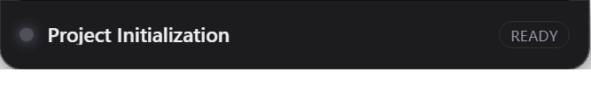

# DSH Notch for Windows

Windows 版的刘海灵动岛。**状态：已实现，并在 Windows 11 真机上跑通。**

> 接手时的状态是「数据层完成、UI 未做、一行都没在 Windows 上跑过」。
> 现在 UI/托盘/跳转/打包/插件自动安装都已补齐，并在**真机 + 真实 `~/.dsh`
> 会话数据**上验过。下面凡是标 ✅ 的都是跑出来的，不是推理出来的。

## 现在有什么

```
windows/
├── README.md              ← 你在这里
├── package.json           Electron 壳（独立子项目，不受根 package.json 的 type:module 影响）
├── assets/                icon.png / tray.png / icon.ico（make-icons.js 生成，零依赖）
├── scripts/
│   ├── dev.js             npm start 的启动器（必须先清掉 ELECTRON_RUN_AS_NODE）
│   ├── make-icons.js      手写 PNG/ICO 编码器
│   ├── make-sums.js       给 dist 产物算 SHA256SUMS.txt（格式与插件 parseSums 对齐）
│   └── probe.js           喂真实 ~/.dsh 数据，打印 monitor 的判定结果（排障用）
├── src/
│   ├── session-source.js  ✅ 会话发现 + zstd 解压 + 事件解码
│   ├── projections.js     ✅ 读 DSH 的投影快照 + 宽松解析
│   ├── config.js          ✅ 读 client-config.json（与 macOS 版同一份协议）
│   ├── activity.js        ✅ Activity / ActivityCursor 移植（状态机 + 文本抽取）
│   ├── monitor.js         ✅ SessionMonitor 移植 + Windows 侧的状态推断
│   ├── bridge.js          ✅ 本机跳转桥的客户端半边（POST /jump、GET /health）
│   ├── jump.js            ✅ 跳转流程（置前 → 投桥 → 剪贴板降级）
│   ├── main.js            ✅ 主进程：无边框置顶小窗 + 托盘 + 250ms 轮询 + IPC
│   ├── preload.js         ✅ contextBridge 暴露最小能力（不开放 node）
│   ├── index.html         ✅ 岛的骨架
│   ├── styles.css         ✅ 折叠条 / 展开面板 / 会话行
│   └── renderer.js        ✅ 渲染逻辑（HTML 转义、高度回传）
└── test/                  ✅ 8 个套件，291 项断言 + e2e 26 项
```

## 真机验证结论

环境：Windows 11（内部版本 26200）、Electron **44.7.0**（Node **24.21.0** / Chromium 152）。

| 项 | 结果 |
| :--- | :--- |
| 自测（数据层 + 状态机 + 桥 + 跳转 + 入口契约） | **291 通过 / 0 失败** |
| 起来并渲染真实会话 | ✅ 冒烟输出 `渲染文本 = "Project Initialization\nREADY"`、`窗口尺寸 = 381x47`、`会话数 = 1` |
| 无边框置顶小窗 | ✅ 常驻顶部，跨桌面不被遮挡 |
| 托盘 + 右键菜单 | ✅ 显示/隐藏、开机自启、桥状态、打开配置目录、打开 DSH 设置、退出 |
| 点击会话行 → 换会话 | ⚠️ **协议侧 5 段已端到端跑通**（e2e 26 项）；真实 `openSession` 需本机跑着 DSH 才验得了 —— 见下 |
| 打包 | ✅ `dist/DSHNotch-<ver>-win-x64.zip` + NSIS 安装包 |
| **zip 解压即跑**（插件自动安装走的就是这条） | ✅ 用插件同一条命令 `Expand-Archive` 解压 → 直接起 exe → 冒烟输出 `渲染文本 = "Project Initialization\nREADY"`、`窗口尺寸 = 381x47`、`会话数 = 1` |
| NSIS 安装向导 | ⚠️ 产物生成正常，静默安装**没跑通**（`/S` 后进程挂着没落地），未实测 |
| 插件服务端自动安装 | ✅ 逻辑已实现并有 38 项断言；**真下载没跑完** —— 本机被 MITM 代理的证书卡住（原因与结论见下文「带 MITM 代理的机器」一节） |
| 插件能被 DSH 加载 | ✅ 在真实 profile 里注册后 `import('@dsh-external/dsh-vibe-island')` 成功（26ms），导出 `apply/inject/...` |

## 外形：从屏幕顶边「长出来」，而不是贴了个黑药丸




macOS 上物理刘海是个方角矩形缺口，岛是它的延伸。Windows 没有刘海，
直接画个悬浮药丸只会像贴了膏药 —— 缺了「它从屏幕顶部长出来」这个视觉锚点。

做法照搬 `swift/UI/NotchShape.swift` 的结论：**顶边平直压在屏幕顶边之外，
方角落在屏幕外没人看得见**，整体就读作「从屏幕边缘长出来的一块」。
Windows 上的实现是三处协作，缺一不可：

| 文件 | 做什么 |
| :--- | :--- |
| `index.html` | 加 `.neck` 节点（`aria-hidden`，纯装饰） |
| `styles.css` | `.neck` 用负 `margin-top` 探出岛的 box；`pointer-events:none` |
| `main.js` | `NECK_OVERHANG = 10`：窗口 `y = workArea.y - 10` 探到屏幕外，高度 `+10` |

⚠️ `pointer-events: none` 那行不是装饰 —— 颈部悬在屏幕最顶端，
若能接收点击，会凭空吃掉一条 10px 高的点击带，用户点屏幕顶端「最大化按钮附近」
毫无反应，且极难归因。

三者的数值必须一致（`NECK_OVERHANG` = CSS `.neck` 高度 = 10），
差 1px 就会露边。`test/setup-entry.test.js` 的 S8 组（13 项断言）就钉这个。
| 跳转桥在真机上活着 | ✅ `apply()` 日志 `平台=win32 arch=x64`、`bridge: 已就绪 http://127.0.0.1:47311`；`/health` 200，`POST /jump` → `GET /next` 全链路通 |

### 为什么必须是 Electron ≥ 42

会话文件是 **zstd** 压缩的，解码走 Node 内置的 `zlib.zstdDecompressSync`。
Electron 33 = Node 20.18，**没有这个函数**。升级到 44 后实测
`typeof zstdDecompressSync === 'function'`。

### 三个踩到并已修的真机问题

1. **GPU 进程反复崩溃**（`FATAL: gpu_data_manager_impl_private.cc:417`），
   崩到整个 app 退出。只加 `app.disableHardwareAcceleration()` 不够 ——
   GPU 进程照样会起来。最终用 `disable-gpu` + `disable-gpu-compositing` +
   `in-process-gpu` 一起压住。
2. **窗口每 resize 一次长大 2px**（DPI 1.75 下 `385x51 → 387x53 → … → 401x67`）。
   原因是先 `setSize` 再 `setPosition` 分两步做。改成**原子的 `setBounds`**
   + 2px 容差后稳定在 `381x47`。
3. **`require('electron')` 返回的是路径字符串而不是 API 对象**，Electron 退化成
   普通 Node。宿主终端里带着 `ELECTRON_RUN_AS_NODE=1` 就会这样。
   - `npm start` 经 `scripts/dev.js` 起，它会先把这个变量删掉
   - **手动跑打包好的 exe 时必须 `env -u ELECTRON_RUN_AS_NODE`**。
     这个坑的杀伤力在于它是**静默**的：exe 会在 1 秒内退出，终端只剩一行
     无关的 crashpad 报错，看起来像「打包坏了」。排查时我一度以为是
     打包模式本身有问题，其实代码一点毛病没有。

## 数据现状：能显示什么、不能显示什么（**先读这段**）

用真实数据实测出一个**必须先讲清的限制**，否则会做出「看起来有实时状态、
其实只是静态快照」的东西。

### 事件流里没有状态事件

`session.v4.jsonl.zstd` 解压后，`type` **只有 `session` 一种**，连 `seq` 都没有。
所以 macOS 版 `ActivityCursor` 依赖的事件流判定（`thinking` / `tool` / `waiting`）
**在真实数据上永远走不到**。`activity.js` 照原样移植了（协议一旦补全立刻能用），
但**当前实际生效的是投影侧判定**。

### 174 份真实投影的统计结果

| 信号 | 出现次数 | 能不能当「执行中」的判据 |
| :--- | :--- | :--- |
| `pendingCalls > 0` | **0 / 174** | 不能 —— 从来不出现 |
| `openStep != null` | 3 / 174 | 很弱 —— 只在极少数时刻为真 |
| 投影文件**刚被写过**（mtime < 8s） | —— | **目前唯一可靠的信号** |

所以 `monitor.js` 里的判定是：`openStep || pendingCalls || 文件刚被写过`。
最后那条是**启发式**，不是协议保证；不想吃它就把它关掉 ——
`monitor.js` 里的 `LIVE_WRITE_MS` 置 0 即可（注释里写了位置）。

这条限制必须如实反映在 UI 上：**没有信号时就显示 READY，不要假装在跑。**

### 三条移植时踩到的形态坑（都已加断言）

1. **`title.val` 是裸字符串**，不是对象。第一版按对象取 → 标题整个丢掉
2. **`pendingCalls` 是对象** `{callId: {…}}`，不是数组。
   第一版用 `Array.isArray()` → 永远空 → 判定不出「正在执行」。
   **而自造样本里塞的是数组，所以测试一直是绿的** ——
   假样本骗过了测试，这类断言必须用真实形态
3. **投影文件名有两种**：`session-<id>.json` 与 `<id>.json`（实测两种都有）

## 与 macOS 版共享的东西

| 共享 | 形式 | 说明 |
| :--- | :--- | :--- |
| **配置协议** | `client-config.json` | 键名与语义完全一致。Windows 路径 `%APPDATA%\DSHNotch\`（插件的 `appDataDir()` 已按平台解析） |
| **本机桥** | `127.0.0.1:47311` | 纯 `node:http`，跨平台通用。Windows 上照样 `POST /jump` |
| **会话数据源** | `%USERPROFILE%\.dsh\sessions\**\session.v4.jsonl.zstd` | 纯文件读取 + zstd 解压 |

## 为什么用 Electron

1. **DSH 本身就是 Electron**，视觉与输入行为能对齐，不会出现「两个 Electron
   抢焦点」的怪问题
2. **无边框置顶小窗** Electron 几十行就能做；原生 Win32 要处理
   `WS_EX_LAYERED` / `WS_EX_TRANSPARENT` / `SetWindowPos(HWND_TOPMOST)` /
   点击穿透等一堆细节，而且每处都有坑
3. **托盘** Electron 有原生 `Tray`，原生 Win32 要自己画图标 + 处理右键菜单与 DPI
4. **zstd 解压** Node 22+ 内置 `zstdDecompressSync`，不必像 macOS 版那样自带
   zstdlite 二进制

**代价**：安装包 111 MB、zip 146 MB（macOS 版 1.2 MB）。对「常驻小工具」
来说偏大，但换来的是少踩 Win32 的坑。
试过 `compression: maximum`：**只小了 0.24%**（153.16 MB → 152.79 MB），
构建时间却从 2m46s 涨到 13m19s —— 不划算，已回退。
再往下只能靠裁 Electron 的 locales，收益不到 5%，也不值得。

## 怎么构建与运行

```powershell
npm install
npm run electron:install   # Electron 42 起 postinstall 不再拉二进制，必须显式跑
npm test                   # 291 项自测
node test/run.js e2e        # 26 项：起真桥验跳转链路（有副作用，不进默认）
npm start                  # 开发运行（会起真实的岛）
npm run dist               # 打包 → dist/
```

排障用 `node scripts/probe.js`：它喂**真实** `~/.dsh` 数据，打印每个会话的
状态 / 标题 / 上下文 / todo / 输出，加 `--raw` 还能看投影原始字段。

两个只在排障时用的开关（**都不影响正常运行**）：

| 环境变量 | 作用 |
| :--- | :--- |
| `DSH_NOTCH_SMOKE=1` | 把岛显示出来、读回渲染文本与窗口尺寸，然后自己退出。CI 用它验 UI |
| `DSH_NOTCH_SMOKE_OUT=<文件>` | 把上面那几行写进文件。**打包后的 exe 是 GUI 子系统进程，`console.log` 一个字都看不到**，只能靠它 |
| `DSH_NOTCH_TRACE=<文件>` | 把启动过程逐步写进文件（含 `packaged` / `resourcesPath` / 单实例锁 / 未捕获异常）。「exe 起不来」时先看这个 |

验证打包产物能不能跑：

```powershell
# 注意 -u ELECTRON_RUN_AS_NODE：少了它 exe 会静默秒退，伪装成「打包坏了」
env -u ELECTRON_RUN_AS_NODE `
    DSH_NOTCH_SMOKE=1 DSH_NOTCH_SMOKE_OUT=C:\Temp\smoke.txt `
    .\dist\win-unpacked\DSHNotch.exe
Get-Content C:\Temp\smoke.txt
```

## 已知限制（都写在这儿，不藏）

| 限制 | 现状 | 为什么会这样 |
| :--- | :--- | :--- |
| **置前 DSH** | 降级为「复制标题 + 提示 Ctrl+K」 | `dsh://open` 是 DSH 唯一的深链，**它在 Windows 上是否注册过未实测**；`shell.openExternal` 打不开时会被捕获并记录。Windows 也没有 CGEvent 那种「按键给别的 app」的能力 |
| **端到端跳转** | **协议链路 5 段已跑通**（`node test/run.js e2e`，26 项） | 仍有一处测不了：**DSH 渲染进程里的真实 `uiWorkspace.openSession`** —— 需要本机装着并运行着 DSH。而协议侧已验到位：端口发现（顺延后读到真端口而非 47311）→ `POST /jump` 入队 → `GET /next` 取走 → sessionId/title 完整传递 → 队列清空（不会把用户劫持到旧会话）→ 桥断时优雅降级 |
| **NSIS 安装向导** | 静默安装没跑通，未实测 | 插件自动安装用的是 zip（`Expand-Archive`），那条路已验到底；NSIS 只服务手动安装 |
| **自动安装的下载环节** | 逻辑 + 38 项断言，未真跑完 | release 里还没有 win 附件，跑也只能是「取不到 SHA256SUMS.txt」。**另有一道环境门槛，见下一节** |
| **状态推断** | 靠「文件刚被写过」这个启发式 | 见上文 174 份投影的统计 |
| **Electron 体积** | 111 MB 安装包 | 换来的代价，见上 |

## 带 MITM 代理的机器上，自动安装会失败（已知，且非代码可修）

这台开发机装了 Steam++（SteamTools）做加速，它把 HTTPS 换成自签证书。
结果是插件下载 app 那一步报：

```
unable to verify the first certificate
  → 中间签发者「SteamTools Certificate」的根证书不在本插件的信任集合里。
    请在该代理/抓包工具里导出根证书并装入 Windows「受信任的根证书颁发机构」，
    或导出 PEM 后设环境变量 NODE_EXTRA_CA_CERTS 指向它。
```

**这一段是 2026-10-10 专门查清的，结论与最初的猜测相反**，所以完整记下来：

| 曾尝试的方案 | 实测结果 |
| :--- | :--- |
| `systemCACertificates()` 读 Windows 证书存储（certutil） | ❌ 读到 **0 张**。`spawnSync` 在本环境起 `cmd`/`certutil`/`node`/`where` **全部 EBUSY** —— 是环境禁子进程，不是存储为空（诊断串已能区分这两者） |
| 用 PowerShell 的 `cert:` 提供程序读 | ❌ 同样依赖子进程，同样失败 |
| 「从代理隧道里把 leaf 拿出来当 CA 用」 | ❌ 原理上不可能。实测该代理**只发 leaf**：`issuerCertificate` 不存在，`getPeerCertificate()` 沿链上溯**链长 = 1**。而 leaf 是 `ca=false`、非自签（`subject ≠ issuer`）、自验签名 `verify(ownKey) = false`。**issuer 的公钥根本不在网络上传输**，没有它就无法构造信任锚；把 leaf 塞进 `ca` 实测仍是 `UNABLE_TO_VERIFY_LEAF_SIGNATURE` |

所以**代码层面解决不了**：缺的那张根证书只能从系统证书存储取到，而本环境
读不了存储。开发中一度真的实现了「用 leaf 当 CA」并接进 `httpsGet`，实测
必然失败、还把错误信息变得更绕，**已回退**，并加了断言锁住不让它回归
（`test-install-win.mjs` 的 W8 组）。

**用户侧的两条出路**（都不该由插件替他放宽安全边界）：
1. 在 Steam++ / 抓包工具里导出根证书，装入「受信任的根证书颁发机构」；
2. 导出 PEM 后设 `NODE_EXTRA_CA_CERTS` 指向它。

代码在 CA 到手后是通的：`httpsGet` 把系统 CA 并入 `ca`，证书链照常严格校验
（签名、有效期、主机名一个不少）—— 这不是「关掉校验」，全文件代码里
`rejectUnauthorized: false` **有且只有一处**，就是那个只读探测函数，且有断言守着。

自动安装的三条纪律与 macOS 侧完全一致：**只装缺失的**（已装就一个字节都不动）、
**SHA256 不符就中止**（下坏的二进制再执行，比不装危险得多）、**每一步都打日志**。
装到 `%LOCALAPPDATA%\Programs\DSHNotch` 而不是 `%ProgramFiles%` —— 后者要 UAC，
而插件跑在宿主进程里，不该弹窗。

## 调试开关

| 环境变量 | 作用 |
| :--- | :--- |
| `DSH_NOTCH_SMOKE=1` | 起来后打印渲染文本/窗口尺寸/会话数就走，不开窗口常驻 |
| `DSH_NOTCH_SMOKE_OUT=<path>` | 把上面那几行**写进文件**（打包后的 exe 没有控制台，只能这样拿结果） |
| `DSH_NOTCH_TRACE=<path>` | 把启动各阶段（单实例锁 / ready / window / tray / 轮询）逐行追加写文件 |
| `NODE_EXTRA_CA_CERTS=<pem>` | 让 `node:https` 额外信任指定 CA（带 MITM 代理时必须） |

⚠️ 在本开发环境跑打包后的 exe，**必须 `env -u ELECTRON_RUN_AS_NODE`** ——
会话里带着这个变量，Electron 会退化成纯 Node，exe 秒退且几乎无输出。
